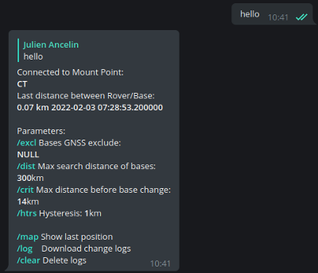

# **RtkBaseVar**

Broadcasting the RTCM3 correction from the nearest RTK station

## Description

GNSS station networks, also called CORS (Continuously Operating Reference Station), such as the CentipedeRTK network, use a point-to-point connection method. In short, a user must connect to a caster and choose the GNSS station (Mount point) in the network closest to his position. This method is restrictive because if the station is not available or if the user is travelling, such as by car, he/she has to change the Mount Point manually.

RtkBaseVar is a personal RTCM3 correction caster for high precision RTK geolocation in mobility. It is an assistant that automatically connects you to the Mount Point closest to your position.

RtkBaseVar is written in Python, its deployment is done by Docker container. It can be orchestrated for multiple sessions for multi-user use.

## Features:

* Connect to the nearest operating GNSS station.
* Continuously check that the GNSS station is still active.
* Change GNSS station:
  * in case of power failure
  * If a station is closer but with configurable rules.
* Use a personal Telegram bot to communicate with it.
* Communicates station changes by sending notifications to his smartphone.
* Records these changes to make them available for download and use with GIS software like Qgis.
* Can be dynamically configured and queried by asking questions to the Telegram bot.
  * Exclusion of stations
  * Maximum distance to search for a station
  * Maximum distance before changing station
  * Hysteresis on the maximum distance and between two distant stations
  * Visualisation of the last coordinates sent by the Rover:
    * Data
    * Map
  * Download of logs in .csv format
  * Ability to purge logs
  * Restart of services





## Connect the Rover Ntripclient

Your Rover or NTRIP client must be able to send an NMEA GGA frame to the Caster to retrieve your position.
* [Lefebure](https://play.google.com/store/apps/details?id=com.lefebure.ntripclient&hl=fr&gl=fr) :x:
* [BluetoothGNSS](https://play.google.com/store/apps/details?id=com.clearevo.bluetooth_gnss&hl=fr&gl=fr) :heavy_check_mark:
* [Swmaps](https://play.google.com/store/apps/details?id=np.com.softwel.swmaps&hl=fr&gl=fr) :heavy_check_mark:
* [RtkGPS+](https://docs.centipede.fr/docs/Rover_rtklib_android/#application-rtkgps-android-open-source) :heavy_check_mark:
* [RTKNAVI](http://rtkexplorer.com/downloads/rtklib-code/) :heavy_check_mark:
* [RTKRCV](https://github.com/tomojitakasu/RTKLIB) :heavy_check_mark:
* ...

Connect your Rover's NTRIPclient to your RtkBaseVar session:

* Adresse: IP or DNS
* Port: 9999
* Mount name: ME
* No login & pasword

# Installation

## Create a personal Telegram bot.

* [Creating a Telegram bot account](https://usp-python.github.io/06-bot/)

* Connect to Telegram account, search and connect to the bot:
  * Click to **start**
  * Bot send you ```/start```
  * It's Ok, you will receive a notification and send messages.

* Get your **APIKEY** and **USERID** and complete and complete the ```docker-compose.yml``` file

## First Build & Run:

* Make sure you have edited the docker-compose.yml with the **APIKEY** and **USERID**
* Clone repo
```
git clone https://github.com/jancelin/RtkBaseVar.git
cd ./RtkBaseVar
```

* build RtkBaseVar
```docker-compose build```

* first start-up to see the logs and potential errors:
```docker-compose up```

* connect your ntripclient to:
  * Your ip or DNS
  * Port: 9999
  * Mount name: ME

Now basevar get NMEA data from Rover every X seconds, check lon lat, research nearest Base GNSS on the caster Centipede and create a connexion.

* Run as deamon
```docker-compose up -d```
