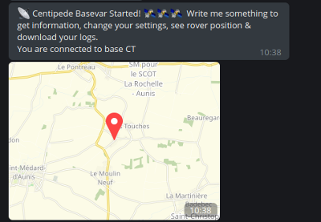

# **RtkBaseVar**

Broadcasting the RTCM3 correction from the nearest RTK station

## Description

GNSS station networks, also called CORS (Continuously Operating Reference Station), such as the CentipedeRTK network, use a point-to-point connection method. In short, a user must connect to a caster and choose the GNSS station (Mount point) in the network closest to his position. This method is restrictive because if the station is not available or if the user is travelling, such as by car, he/she has to change the Mount Point manually.

RtkBaseVar is a personal RTCM3 correction caster for high precision RTK geolocation in mobility. It is an assistant that automatically connects you to the Mount Point closest to your position.

RtkBaseVar is written in Python, its deployment is done by Docker container. It can be orchestrated for multiple sessions for multi-user use.

## Features:

* Connect to the nearest operating GNSS station.
* Continuously check that the GNSS station is still active.
* Change GNSS station:
  * in case of power failure
  * If a station is closer but with configurable rules.
* Use a personal Telegram bot to communicate with it.
* Communicates station changes by sending notifications to his smartphone.
* Records these changes to make them available for download and use with GIS software like Qgis.
* Can be dynamically configured and queried by asking questions to the Telegram bot.
  * Exclusion of stations
  * Maximum distance to search for a station
  * Maximum distance before changing station
  * Hysteresis on the maximum distance and between two distant stations
  * Visualisation of the last coordinates sent by the Rover:
    * Data
    * Map
  * Download of logs in .csv format
  * Ability to purge logs
  * Restart of services




## Connect the Rover Ntripclient

Your Rover or NTRIP client must be able to send an NMEA GGA frame to the Caster to retrieve your position.
* [Lefebure](https://play.google.com/store/apps/details?id=com.lefebure.ntripclient&hl=fr&gl=fr) :x:
* [BluetoothGNSS](https://play.google.com/store/apps/details?id=com.clearevo.bluetooth_gnss&hl=fr&gl=fr) :heavy_check_mark:
* [Swmaps](https://play.google.com/store/apps/details?id=np.com.softwel.swmaps&hl=fr&gl=fr) :heavy_check_mark:
* [RtkGPS+](https://docs.centipede.fr/docs/Rover_rtklib_android/#application-rtkgps-android-open-source) :heavy_check_mark:
* [RTKNAVI](http://rtkexplorer.com/downloads/rtklib-code/) :heavy_check_mark:
* [RTKRCV](https://github.com/tomojitakasu/RTKLIB) :heavy_check_mark:
* ...

Connect your Rover's NTRIPclient to your RtkBaseVar session:

* Adresse: IP or DNS
* Port: 9999
* Mount name: ME
* No login & pasword

## Parameters

All parameters are editable by the Telegram bot, type any word or letter to access the parameter menu of RtkBaseVar. You can also write directly the action to ask the bot.


* **/excl** : list of GNSS stations to exclude from the search. Always in uppercase and a space between the stations. ex: **CT LIENSS SLP NOVA**
* **/dist** : Maximum search distance of a base. Enter a integer number in kilometres.
* **/crit** : Maximum distance before changing stations. In the case of several stations close together, RtkBaseVar will remain on the same base as long as this distance is not crossed and this even if the user is closer to a new base. Enter an integer number in kilometres.
* **/htrs** : Hysteresis, Distance to be added to /crit or if exceeded, to the distance between 2 bases. This allows you to avoid changing stations if you are working at equal distance between 2 stations. Enter an integer number in kilometres.

* **/map** : Displays the last coordinates sent by the rover, the date, fix quality, HDOP, altitude, station id (when there is one) and on which base you are connected. A map allows to visualize this information easily.
* **/log** : Download the station change log file for use as metadata with its collected data.
* **/clear** : Clears the data from the log file for new data collection.

* **/restart** : Restarts the service, this is useful if the service crashes due to a bug.

# Installation

## How it works

* [Socat](https://linux.die.net/man/1/socat) creates two virtual ports /dev/pts/1 and /dev/pts/2
* Two data streams are created with rtklib [str2str](https://manpages.debian.org/unstable/rtklib/str2str.1.en.html):
  * between the caster centipede ```ntrip://:@caster.centipede.fr:80/``` + Mountpoint variable and the port ```pts/1```
  * between the ```pts/2``` port and your personal caster ```ntripc://@:9999/ME```
* A loop check continuously:
  * the status of stations within a defined distance
  * location data sent by the rover
  * the distance between the rover and the stations according to the defined parameters
* Rtkbase chooses the most suitable station to work with and modifies the first data stream.
* Messages and interactions are possible between the user and the program through a Telegram bot

## Create a personal Telegram bot.

* [Creating a Telegram bot account](https://usp-python.github.io/06-bot/)
  * First, we need to have a telegram account (bot) to access. Talk to @Botfather, a telegram bot by telegram to create telegram bots, to create a bot. Copy and paste the HTTP API somewhere

  

  * You will also need to know your own telegram user ID, so the bot knows who to send messages to. Talk to @userinfobot to get this information. Once again, copy this information down somewhere.

  

* Save in a file your acess token :**APIKEY=** and user id **USERID=**

* Connect to Telegram account, search and connect to the bot:
  * Click to **start**
  * Bot send you ```/start```
  * It's Ok, you will receive a notification and send messages.

## Install docker

> The installation is possible without Docker by following the procedure in the [Dockerfile](https://raw.githubusercontent.com/jancelin/RtkBaseVar/main/dockerfile), attention to the integration of Telegram bot **APIKEY** and your **USERID** in [./pybasevar/run.sh](https://raw.githubusercontent.com/jancelin/RtkBaseVar/main/pybasevar/run.sh).

Docker is an open platform for developing, shipping, and running applications. Docker enables you to separate your applications from your infrastructure so you can deliver software quickly.

Install Docker et Docker-compose :

```
sudo apt-get update
sudo apt-get install curl
curl -fsSL https://get.docker.com/ | sh
sudo systemctl enable docker
sudo service docker start
sudo groupadd docker
sudo usermod -aG docker $USER

sudo apt-get install python-pip
sudo pip install docker-compose
````

[https://docs.docker.com/get-docker/](https://docs.docker.com/get-docker/)

## First Build & Run:

* Check that your server, router or PC has port 9999 open. It is possible to change the output port in the ```docker-compose.yml```
* Clone RtkBaseVar repo
```
git clone https://github.com/jancelin/RtkBaseVar.git
cd ./RtkBaseVar
```
* Edit the docker-compose.yml with the Telegram bot **APIKEY** and your **USERID**

* Build RtkBaseVar
```docker-compose build```

* First start-up to see the logs and potential errors:
```docker-compose up```

* Connect your ntripclient to:
  * Your ip or DNS
  * Port: 9999
  * Mount name: ME

Now RtkBaseVar get NMEA data from Rover every X seconds, check lon lat, research nearest Base GNSS on the caster Centipede and create a connexion.

* Run as deamon
```docker-compose up -d```
